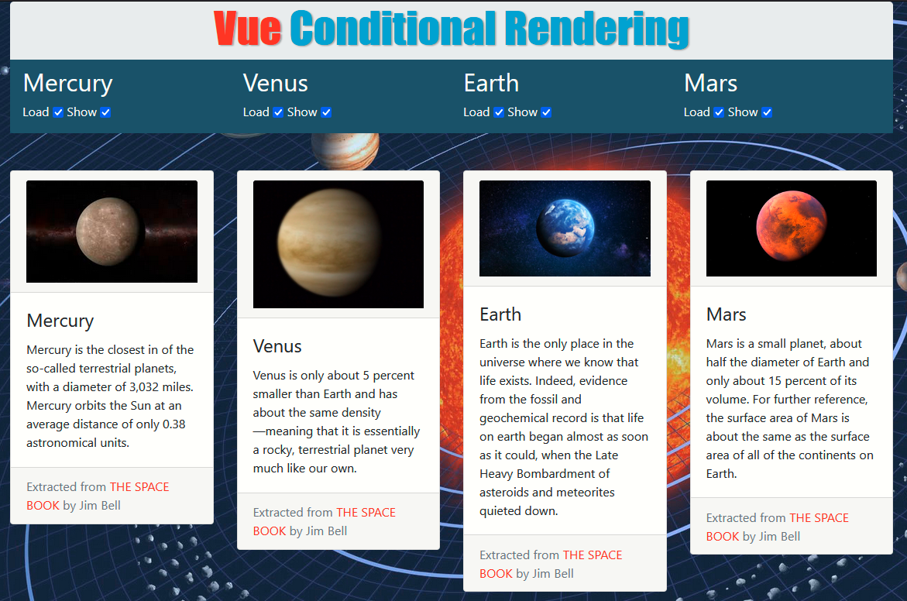

# Vue Conditional Rendering

## screenshot

## About this code

This code example shows how to use Vue contional rendering directives such as v-if and  v-show to load or show elements already exist in the document.
You can play with the checkboxes to load or hide planet details of the four
terrestrial solar planets

## How to run this code

To run this code example, simply download the code and open the folder and find `index.html` and open it with your web browser. The javaScript code is in the file named `index.js`, which defines the  `Vue` code for this demo.

## Author

This code example was writted by [Hassan Mugabo - aka Codeparl](https://github.com/codeparl)

## More code examples

For more code examples, please checkout [codeparl.com](https://codeparl.com)

## License

Licensed under MIT (https://github.com/codeparl/Vue-Conditional-Rendering/blob/master/LICENSE)